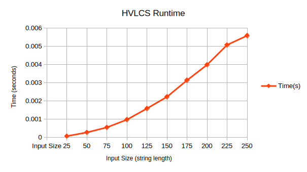

# Programming Assignment 3

## Requirements
Python 3.10 or later.

## Quick Start

```
python src/main.py path_to_input_file
```

Example: `python src/main.py inputs/example1.in`

## Exercises

### Runtime



### Recurrence Equation

```
let a, b be the strings indexed by i and j respectively.
let w be the weights for each character.

OPT(i, j) = 0 if i == 0 or j == 0
          = max(OPT(i-1, j), OPT(i, j-1)) if a[i] != b[j]
          = OPT(i-1, j-1) + w[a[i]] if a[i] == b[j]
```

The base case occurs when one of the strings is empty, meaning that there can't be a common subsequence. In this case the highest value is 0. From there, if a[i] = b[j], then the shared character can be added to the longest common subsequence. Since weights are non-negative, it never hurts to add a character to the previous longest common subsequence, so that choice is always taken. The previous longest subsequence is the optimal solution to each of the strings not including the shared last character. In the case where a\[i\] != b\[j\], then we pick the best solution between removing the last character in a vs removing the last character in b.

### Big Oh Time Complexity

```
a is a string of length n.
b is a string of length m.
w is the character weights.

let m be an n x m 2d array, initialized to 0.

for i in n {
    for j in m {
        if i == 0 or j == 0 {
            m[i, j] = 0
        } else if a[i] == b[j] {
            m[i, j] = w[a[i]] + m[i-1, j-1]
        } else {
            m[i-1, j-1] = max(m[i-1, j], m[i, j-1])
        }
    }
}

length = 0
i = n - 1
j = m - 1
while i > 0 and j > 0 {
    if a[i] == b[j] {
        length += 1;
        i -= 1;
        j -= 1;
    } else if m[i-1, j] > m[i, j-1] {
        i -= 1; 
    } else {
        j -= 1;
    }
}

```

Time Complexity: `O(n * m)`
